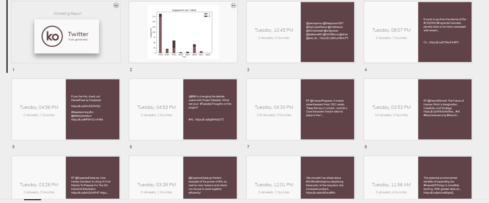

# Tweet2Slides (formerly known as jesssmd)
<!-- TODO: add better docs -->
Quickly generating detailed reports from last week's Twitter engagement.



## Quick Start

1. Create a Twitter app at [apps.twitter.com](https://apps.twitter.com). Take the consumer key and consumer secret and put them in a file "app_secret" separated by a line:
```
<consumer key>
<consumer secret>
```

2. Create a Google Slides app following [this tutorial, step 1](https://developers.google.com/slides/quickstart/python#step_1_turn_on_the_api_name)

3. Install prerequisites either using `pip -r requirements.txt` or as below:

```
pip install google-api-python-client oauth2client # google api
pip install requests # prereq to tweepy
pip install tweepy # twitter API
pip install tqdm # loading bar which you will want for long timelines
```

4. `python main.py` to get started! It might give you URLs and ask for verifiers or codes, just open the URL and authenticate.

5. Profit?

## More details

If you've been approved for the Enterprise API, the Engagement API taken from [this gist](https://gist.github.com/mihaigociu/cbcc0b23fd215ebe486fe290424f5c34) will be available to you. You can use it by simply authenticating with your enterprise account and using the 'enterprise' flag:

```
python main.py --enterprise
```

This is highly experimental and may not always work as the Enterprise API is still a **beta feature** on the Twitter API!

If you experience any bugs please report them so we can continue to improve.